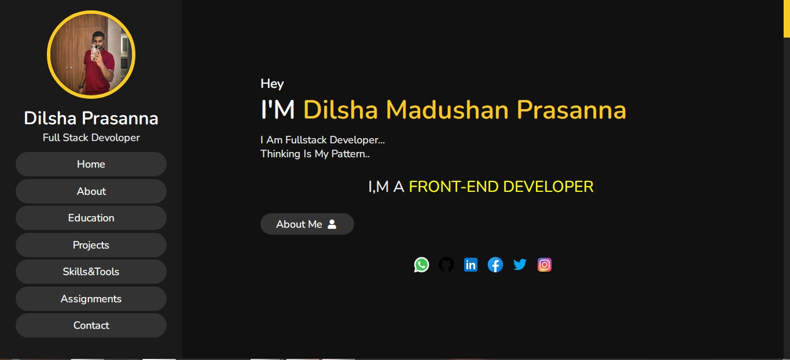

# My-Portfoliyo
Crated My Personal Portfolio

## Description

* Home page
* Who am I
* What I Top Skills
* What are the technologies & Tools I use
* What kind of services I provide
* Projects & assignments I have done
* My Educational Background
* My contact details

🌱 Moke-Up-URL ---> [Click Me!](https://www.figma.com/file/yaKKZmS8nzmqQJTw7KlVRn/My-Personal-portfolio) 
🌱 Wire-Frame-URL ---> [Click Me!](https://wireframe.cc/2J20l9) 
🌱 Site-Map-URL ---> [Click Me!](https://www.gloomaps.com/nFvNK6T6sJ) 

## Basic Background of PortFolio

## Technology /framework used
* HTML
* CSS
* Java Script
